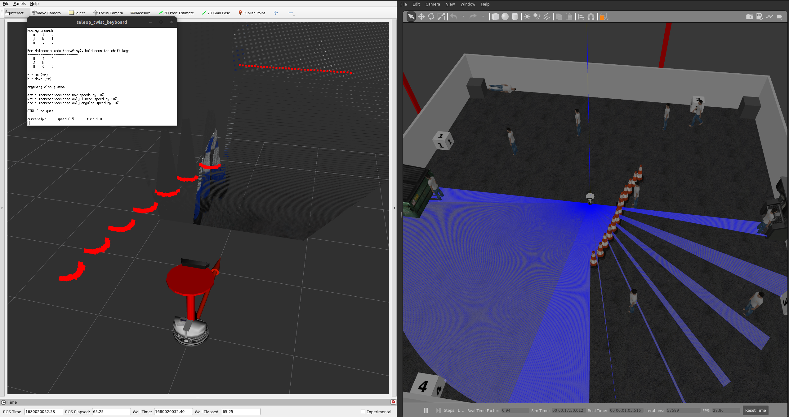
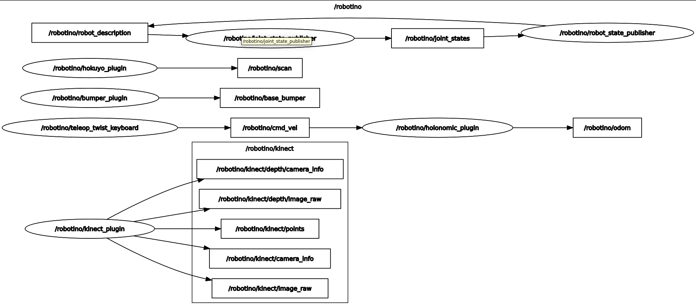

# robotino


Designed by Festo, Robotino 3 is a three-wheeled (mecanum) robot. The model is a modular mobile platform used for educational, training and research purposes.

# Requirements

This package is tested with ROS 2 Humble version (Ubuntu 22.04) and Gazebo 11.

# Downloading and building

```
cd ~/git && git clone git@github.com:NovoG93/robotino.git
cd ~/ros2_ws/src && ln -s ~/git/robotino
cd .. && rosdep install -r -y --from-paths src --ignore-src --rosdistro $ROS_DISTRO && colcon build --packages-select-regex robotino*
```

To use the playground.world file (as depicted below) make sure to install the common gazebo models, for more see the [Readme in robotino_description](./robotino_description/README.md).


# Run

## Docker

1. Start the docker container:   
`bash run_docker.sh`

## ROS 2 Source Installation

1. Start gazebo, spawn drone, open teleop in xterm window, and open rviz:   
`ros2 launch  robotino_bringup robotino_bringup.launch.py`

You should see the following:



For more see the following image:



